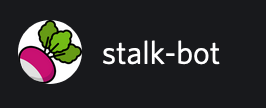

Stalk-Bot API 
==============================================

Getting Started
---------------

These directions assume you want to develop Stalk-Bot on your local computer or a Cloud9 environment.

To work on the sample code, you'll need to clone your project's repository to your
local computer. If you haven't, do that first. You can find instructions in the
AWS CodeStar user guide.

1. Install Node.js on your computer.  For details on available installers visit
   https://nodejs.org/en/download/. If you're using a Cloud9 environment, Node.js is already installed.

2. Install NPM dependencies:

        $ npm install
        
3. Install the SAM CLI. For details visit 
https://docs.aws.amazon.com/serverless-application-model/latest/developerguide/serverless-sam-cli-install.html.

4. Start the development server:

        $ sam local start-api -p 8080

5. Open http://127.0.0.1:8080/ in a web browser to view your service.
